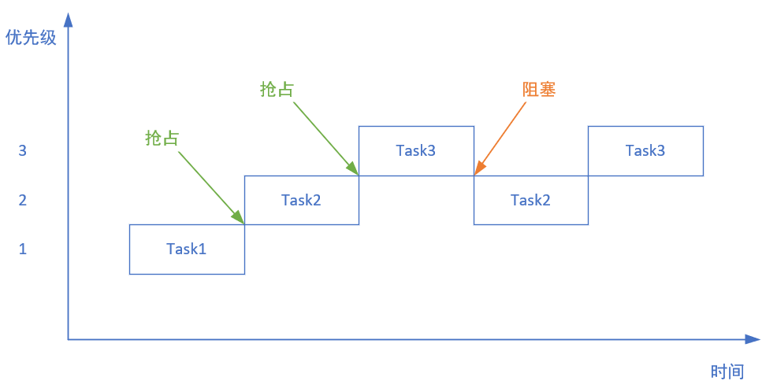
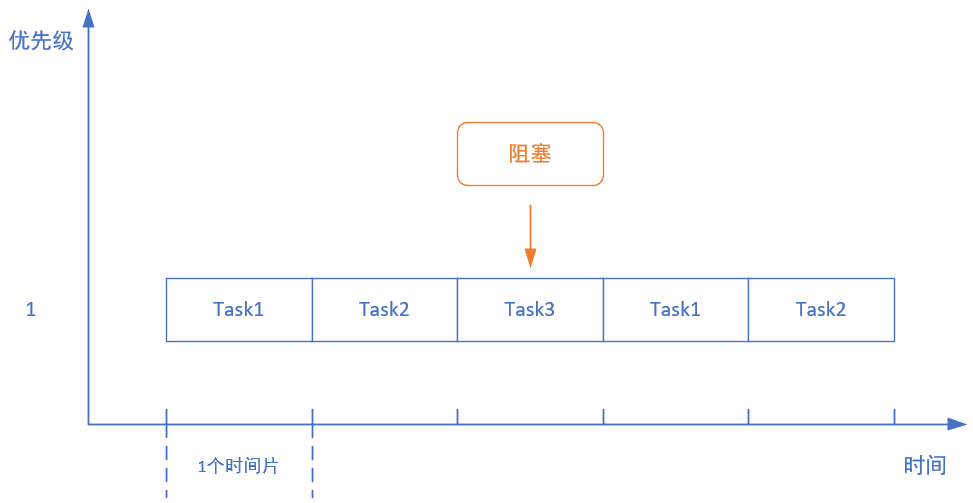
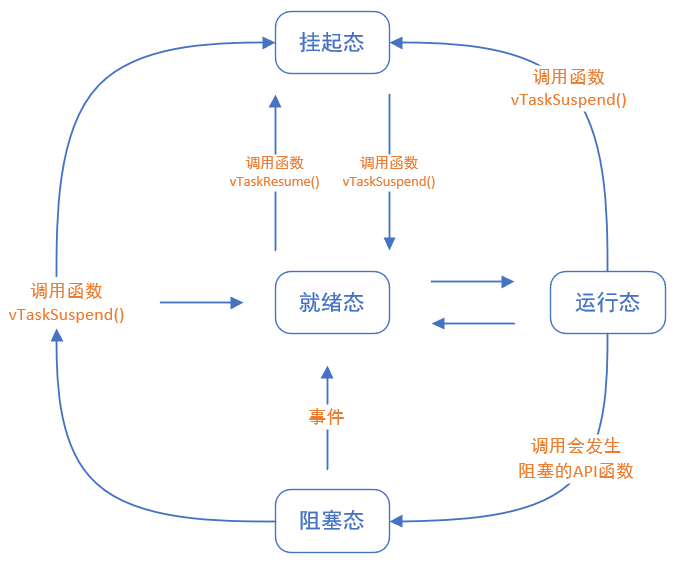

# FreeRTOS

This is a journey with FreeRTOS.

官方初学者指南：[FreeRTOS 初学者指南 - FreeRTOS™](https://www.freertos.org/zh-cn-cmn-s/Documentation/01-FreeRTOS-quick-start/01-Beginners-guide/00-Overview)

官方《掌握 FreeRTOS 实时内核》：[FreeRTOS/FreeRTOS-Kernel-Book](https://github.com/FreeRTOS/FreeRTOS-Kernel-Book?tab=readme-ov-file)

正点原子出品《FreeRTOS开发指南-V1.10.pdf》：[正点原子 FreeRTOS开发指南](./FreeRTOS开发指南_V1.10.pdf)

## 1. 引言

**RTOS**（**Real-Time Operating System**）即**实时操作系统**，是一种能够在严格时间限制内提供确定性响应的操作系统。

---

### 1.1 RTOS的特点

RTOS 有以下几个关键特点：

- **时间确定性**：RTOS 的核心特点是能够保证任务在特定的时间内执行，即**可预测性**。例如，一个任务可能需要在 10 毫秒内完成，如果任务未能在规定的时间内完成，可能会导致系统不稳定，甚至出现故障。
- **任务调度**：RTOS 会管理和调度多个任务。任务可以根据优先级、时间片轮转（round-robin）等策略进行调度。RTOS 通常支持**优先级调度**，高优先级任务会优先执行。
- **中断响应**：RTOS 提供对硬件中断的快速响应。中断是实时系统中常见的事件，RTOS 会确保在接收到中断信号时，能够迅速切换到处理该中断的任务。
- **多任务支持**：RTOS 支持并行处理多个任务，任务通常具有不同的优先级。通过**多线程**和任务管理，RTOS 可以确保多个任务有效运行。
- **资源管理**：RTOS 提供对系统资源（如内存、处理器时间、外设等）的有效管理和分配，避免任务间的资源冲突。
- **实时性**：RTOS 分为硬实时（Hard Real-Time）和软实时（Soft Real-Time）系统：
  - **硬实时系统**：系统必须在指定的时间内完成任务，否则可能导致灾难性后果。
  - **软实时系统**：系统应尽量在指定时间内完成任务，但如果有轻微的延迟，系统依然能够正常运行。

---

### 1.2 RTOS的原理

RTOS 的核心工作原理是**任务调度**，它通过调度算法来确保各个任务按照一定的顺序和优先级得到处理。RTOS 还会通过以下机制来保证实时性：

- **时间片轮转**：RTOS 使用时间片轮转机制（Round-Robin）来分配 CPU 时间。每个任务在时间片内运行，时间片结束后会切换到下一个任务。这种方式适用于多个优先级相同的任务。
- **优先级调度**：在大多数 RTOS 中，任务被分配不同的优先级。高优先级的任务会打断低优先级任务的执行。RTOS 会尽量保证高优先级任务在最短的时间内执行。
- **中断处理**：RTOS 会迅速响应硬件中断，并根据中断类型将控制权交给相应的中断处理程序。实时操作系统能在中断发生时进行任务切换，保证系统能够及时响应外部事件。

---

### 1.3 常用的RTOS

有许多成熟的实时操作系统被广泛应用于嵌入式系统中，以下是一些常见的 RTOS：

- **FreeRTOS**：一个开源的、轻量级的 RTOS，广泛用于嵌入式开发，支持多种微控制器平台，如 ARM、AVR、PIC 等。
  - 优点：**开源且免费、轻量**，资源占用低。
  - 缺点：**内存管理简单，缺少高级功能（GUI、文件系统），原生不支持多核处理器，需要额外配置。**
- **uC/OS-II 和 uC/OS-III**：Micrium 提供的实时操作系统，适用于嵌入式设备，具备丰富的调度和同步机制。
  - 优点：**提供丰富的功能**（多任务调度、文件系统、USB 支持等），商业支持好。
  - 缺点：需要商业购买，且占用资源较高。
- **RTX**：由 Keil 提供的 RTOS，专为 ARM 微控制器设计，支持嵌入式系统开发。
  - 优点：**功能全面，支持文件系统、TCP/IP协议栈，支持多平台（如 ARM、RISC-V、x86）**。
  - 缺点：配置和使用复杂，资源占用高
- **VxWorks**：由 Wind River 提供的商用 RTOS，广泛应用于航空航天、军事、工业自动化等领域，具有强大的实时性能和安全性。
  - 优点：强大的实时性能和安全性，**支持多核和分布式系统**。
  - 缺点：需要商业授权，且对资源要求较高，配置和使用相对麻烦。
- **ChibiOS**：另一个开源、轻量级的 RTOS，支持 ARM 和其他处理器架构，适合嵌入式应用。
  - 优点：开源、轻量，支持多架构，适用于低功耗场景。
  - 缺点：功能简单，缺少高级特性。
- **ThreadX**：由 Express Logic 提供的实时操作系统，广泛用于嵌入式系统，支持高效的多任务调度。
- ....

---

### 1.4 常用术语

#### 1.4.1 进程

**进程（Process），定义：**

- 进程是计算机中程序的一次执行实例。它是操作系统资源分配的基本单位，每个进程都有自己的虚拟地址空间、内存、文件描述符、CPU寄存器等资源。进程由操作系统管理，负责执行程序中的指令。

**特点：**

- 进程之间是独立的，每个进程都有自己的内存空间。
- 进程的创建和销毁由操作系统控制。
- 进程之间的通信通常通过进程间通信（IPC）机制，如管道、消息队列等。

**区别：**

- 进程是资源管理的单位，相对于线程和协程，它具有更高的开销和隔离性。

---

#### 1.4.2 线程

**线程（Thread），定义：**

- 线程是进程中的一个执行单元。一个进程至少包含一个线程（即主线程），但可以包含多个线程。多个线程共享同一进程的内存和资源，但每个线程有自己的栈、寄存器和程序计数器。

**特点：**

- 线程是程序执行的最小单位，多个线程可以并发执行。
- 线程间可以通过共享内存来交换数据，相对进程间通信更高效。
- 创建和销毁线程的开销比进程小，切换线程的上下文切换比进程更快。

**区别：**

- 线程是执行的最小单位，比进程更轻量，但缺少进程的独立性，线程的异常可能导致整个进程崩溃。

---

#### 1.4.3 协程

**协程 (Coroutine)，定义：**

- 协程是用户级的轻量级线程，通常用于实现高效的并发执行。它不像线程那样由操作系统调度，而是通过程序代码控制协程的执行。协程可以在一个线程中多次暂停和恢复执行，常见于异步编程中。

**特点：**

- 协程是在单线程中执行的，并且通过程序控制其执行的暂停与恢复。
- 协程通过事件循环和非阻塞I/O操作来实现并发，不需要像线程那样频繁的上下文切换，因此更加高效。
- 协程不依赖于操作系统调度，因此它们比线程更轻量级。

**区别：**

- 协程通常由应用程序显式控制，而线程由操作系统调度。协程的上下文切换几乎没有成本，而线程切换的成本较高。

---

#### 1.4.4 句柄

**句柄 (Handle)，定义：**

- 句柄是操作系统分配给程序的一个标识符，用于引用和管理操作系统中的资源（如文件、窗口、进程、线程等）。句柄本质上是一个指向资源的指针，程序通过它访问资源。

**特点：**

- 句柄本身是一个标识符，它并不直接暴露资源的内存地址，操作系统通过句柄来跟踪和管理资源。
- 常见的资源句柄包括文件句柄、窗口句柄、进程句柄等。

**区别：**

- 句柄是操作系统提供的一个抽象机制，用于管理各种资源，它不直接涉及程序的并发执行。

---

#### 1.4.5 任务

**任务 (Task)，定义：**

- 任务一般指需要执行的工作单元。在并发编程中，任务通常与线程或协程相关，指代一个可以执行的独立工作单位。任务可以是一个函数、方法或其他形式的执行单元。

**特点：**

- 任务是由程序分配的工作单位，可能通过线程池、事件循环等机制执行。
- 在异步编程中，任务经常与事件驱动模型结合使用，例如 `async/await` 语法。

**区别：**

- 任务侧重于执行逻辑的划分，而线程、协程等则是执行的载体。任务不一定与具体的执行单元（如线程、进程）绑定。

---

## 2. 初识FreeRTOS

### 2.1 任务调度

**调度器**，就是使用相关的调度算法来决定当前需要执行哪个任务。

FreeRTOS支持：

- **抢占式调度**：主要针对优先级不同的任务，每个任务都有优先级，**优先级高的可以抢占优先级低的任务。**
- **时间片调度**：主要针对优先级相同的任务，当多个任务优先级相同时，**调度器会在每一次系统时钟节拍到达时，切换任务。**
- **协程式调度**：**当前执行任务将会一直运行，同时高优先级的任务不会抢占低优先级任务。**（官方不再更新）

---

#### 2.1.1 抢占式调度

假设：

1. 创建三个任务：`Task1`、`Task2`、`Task3`。
2. `Task1`、`Task2`、`Task3`的优先级分别是：1、2、3，**在FreeRTOS中，数值越大，优先级越高。**

**运行过程：**

1. 在`Task1`运行过程中，`Task2`准备就绪，在**抢占式调度器的作用下，`Task2`抢占`Task1`的运行。**
2. 在`Task2`运行过程中，`Task3`准备就绪，`Task2`抢占`Task1`的运行。
3. 在`Task3`运行过程中，`Task3`阻塞了（如：系统延时、等待信号量等），此时CPU释放`Task3`，并执行次最高优先级`Task2`。

总结：

- 高优先级任务，优先执行。
- 高优先级任务不停止，低优先级任务无法执行。
- 被抢占的任务将会进入**就绪态**。

---

#### 2.1.2 时间片调度

同等优先级任务轮流享有相同的CPU时间（可设置），叫**时间片**，在FreeRTOS中，一个时间片就等于`SysTick`中断周期。

假设：

1. 创建三个任务：`Task1`、`Task2`、`Task3`。
2. `Task1`、`Task2`、`Task3`的优先级都为：1，**即，同等优先级。**

**运行过程：**

1. 首先`Task1`运行完一个时间片后，然后切换到`Task2`运行。
2. `Task2`运行完一个时间片后，切换到`Task3`运行。
3. `Task3`运行过程中（还不到一个时间片），`Task3`阻塞了（如：系统延时、等待信号量等），**此时直接切换到下一个任务`Task1`**。
4. `Task1`运行完一个时间片后。切换到`Task2`运行。

总结：

- 同等优先级任务，**轮流执行**，即时间片流转。
- 一个时间片大小，**取决于滴答定时器中断周期**。
- **没有使用完的时间片不会再使用，下次任务`Task3`得到执行，还是按照一个时间片的时间节拍运行。**

---

### 2.2 任务状态

FreeRTOS中共存在4种状态：

- **运行态**：正在执行的任务，该任务就为**运行态**，在STM32中，同一时间仅有一个任务处于运行态。
- **就绪态**：能够被执行，但为执行的任务处于**就绪态**。
- **阻塞态**：任务因**延时或等待外部事件发生**，那这个任务就处于**阻塞态**。
- **挂起态**：类似于**暂停**，**调用`vTaskSuspend()`进入挂起态，需要调用解挂函数`vTaskResume()`进入就绪态**。

四种任务状态的切换关系：

在以上几种状态中，除了运行态，**就绪态、阻塞态、挂起态都有对应的任务状态列表：**

- **就绪列表：**`pxReadyTasksLists[x]`，其中`x`代表任务优先级数值。
- **阻塞列表：**`pxDelayedTaskList`
- **挂起列表：**`xSuspendedTaskList`

即，**`32-bit`的变量，当某个位置一时，代表对应的优先级就绪列表有任务存在**。

总结：

- **调度器总是在所有处于就绪列表的任务中，选择具有最高优先级的任务来执行。**

- **相同优先级的任务会连接在同一个就绪列表上**，然后按照时间片调度方式。

---

### 2.3 获取源码

官网下载网站：[Download FreeRTOS](https://www.freertos.org/zh-cn-cmn-s/Documentation/02-Kernel/01-About-the-FreeRTOS-kernel/03-Download-freeRTOS/01-DownloadFreeRTOS)

主要源码内容：

- **`FreeRTOS`**：FreeRTOS内核
- **`FreeRTOS-Plus`**：FreeRTOS组件，如：MQTT、TCP、IO等
- **`tools`**：工具

针对`FreeRTOS`中的`Source`中的内容：

- **`include`**：包含了FreeRTOS的头文件
- **`portable`**：包含了FreeRTOS的移植文件，包含不同编译平台的移植文件
- **`croutine.c`**：协程相关文件
- **`event_groups.c`**：事件相关文件
- **`list.c`**：列表相关文件
- **`queue.c`**：队列相关文件
- **`stream_buffer.c`**：流式缓冲区相关文件
- **`tasks.c`**：任务相关文件
- **`timers.c`**：软件定时器相关文件

其中核心文件为：**`include`**、**`portable`**、**`list.c`**、**`queue.c`**、**`tasks.c`**。

----

## 3. 移植

